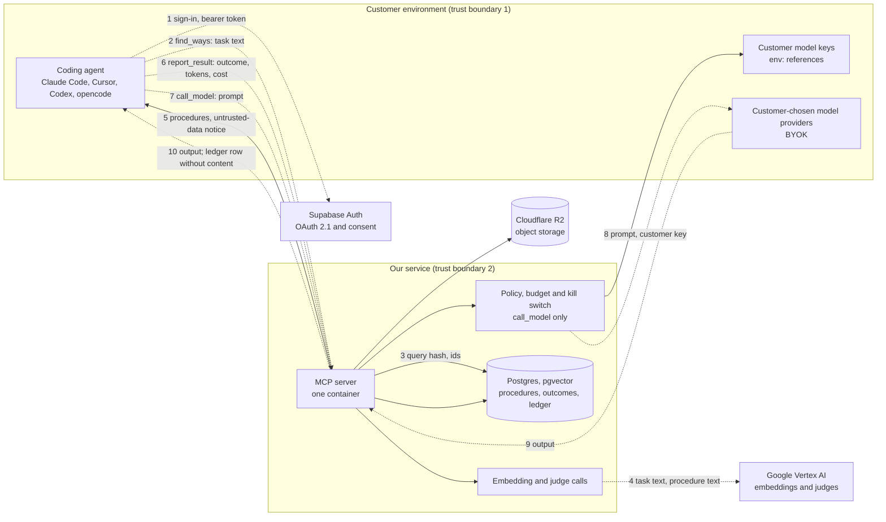

# Data-flow diagram

**DRAFT.** Mermaid renders on GitHub and in most Markdown viewers. Dashed lines cross a trust boundary.

## Reading it

| Step | Data crossing | Stored by us | Note |
|---|---|---|---|
| 1 | Credentials, consent | Supabase | Consent page: no framing, localhost and unnamed-app warnings |
| 2–5 | Task description out, procedures back | Hash only | The Vertex hop (4) sends task text and procedure text to a model provider; this is the flow a customer must approve in the subprocessor list |
| 6 | Outcome and counts | Yes, no content | Bound to the caller who got the plan |
| 7–10 | Prompt and output | Ledger row only | Customer key stays in their secret store. A platform-paid call (no customer key) uses our egress policy and is not the default |
| R2 | Object storage | Yes | Contents to confirm **[unverified]** |

## Not in this diagram, but customers will ask

- The hop from the container host to the database is across the public internet with TLS **[config]**, not a private link.
- Ingestion workers (bulk loading of public procedures) share the database and are a separate process with their own service credential (`docs/service_identity.md`).
- The Cursor and ChatGPT desktop clients keep their own logs of tool results on the user's machine. We cannot control that.
