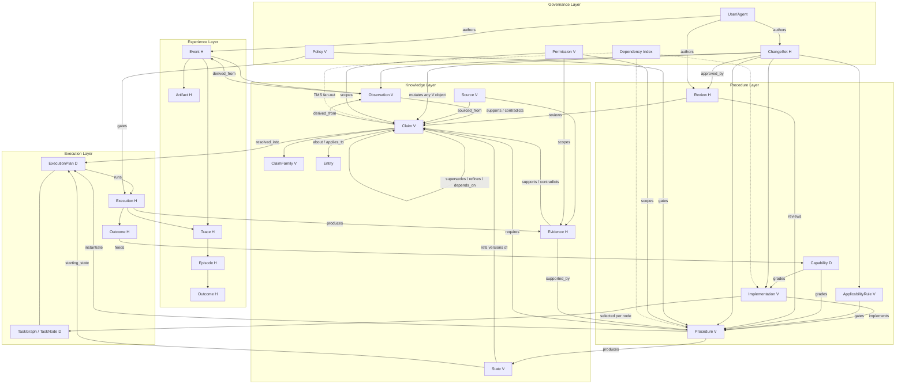

# Verified Procedural Experience System — Data Schemas & Object Map

Source of truth: `verified_procedural_experience_system_ideal_specification_v4.md`

**Mutability classes:** `[V]` versioned-mutable (change only via ChangeSet) · `[H]` historical append-only (never edited; corrections append a superseding record) · `[D]` derived/transient (regenerated, then frozen on first reference)

**Universal fields:** every entity carries `id` and `scope{type: global|organization|team|project|repository|branch|user|session|task, entity_id}`. No entity is ever implicit-global.

---

## Experience Layer

### Event `[H]`
```yaml
Event:
  type: string                  # tool_call | model_response | human_action | system_event ...
  actor_id: string              # → User/Agent
  timestamp: datetime
  environment_id: string
  scope: {type, entity_id}
  input: object
  output: object
  status: success | failure
  parent_event_id: id | null    # causal ordering within a Trace
  artifacts: [→ Artifact]
  source: string                # e.g. claude_code, cursor, api_agent
```

### Trace `[H]`
Ordered, causally connected sequence of Events for one execution. Preserves ordering, parent/child relations, actor, model, tools, inputs/outputs, errors/retries, human intervention, final outcome, environment state. Raw traces remain available even after higher-level objects are created.

### Episode `[H]`
One bounded piece of work.
```yaml
Episode:
  goal: string
  start_time / end_time: datetime
  actor_id: string
  environment_id: string
  initial_state: → State
  final_state: → State
  trace_ids: [→ Trace]
  outcome: → Outcome
```

### Artifact `[H]`
Immutable produced/consumed object: report, screenshot, file diff, test report, model output. Interpreted into Observations by extractors; never edited when extraction improves — new Observations are created against the same Artifact.

---

## Knowledge Layer

### Observation `[V]`
Structured interpretation of events/artifacts.
```yaml
Observation:
  statement: string
  interpretation: {type, subject}
  source_events: [→ Event]
  scope: {type, entity_id}
  confidence: float
  created_by: extractor_id + version
  observed_at: datetime
```
Revisions are first-class: they go through a ChangeSet and re-flag dependent Claims via the dependency queue (§20).

### Claim `[V]`
The complete knowledge object.
```yaml
Claim:
  version: integer
  statement: {text, language}
  proposition:
    type: fact | property | conditional | causal | temporal |
          probabilistic | comparative | procedural | negative | composite
    content: object
  validity: {valid_from, valid_until, observed_at}
  status: supported | disputed | uncertain | stale | superseded | invalid | retracted
  belief: {score, method, last_updated}     # assessment, not probability-of-truth
  provenance: {created_by → Source, created_at}
  required_claims: [claim_id]               # dependency edges for TMS
  permissions: {owner_id, visibility}
```

### ClaimFamily `[V]`
Propositional-identity grouping across communities/domains. Relations: `same_family`, `related_family`, `generalizes`, `specializes`. Similarity is candidate generation, not identity.

### State `[V]`
What is believed true at a point in time.
```yaml
State:
  valid_from: datetime
  valid_until: datetime | null
  claims: [{claim_id, claim_version}]       # references, never embedded claims
  snapshot_hash: string
```

### Evidence `[H]`
Basis used to support or contradict claims.
```yaml
Evidence:
  type: execution_result | observation | experiment | benchmark | document |
        human_review | external_source | artifact | reproduction
  source_id: → Source
  content_ref: → Artifact | null
  strength: {score, method}
  independence_group: string                # same-group evidence never counts as independent
  created_at: datetime
```

### Source `[V]`
Origin registry: agent execution, human action, document, database, API, test, benchmark, community review, external research, sensor, system event. Source reliability is represented separately from claim confidence.

### Review `[H]`
```yaml
Review:
  reviewer: → User/Agent
  position: support | reject | challenge | reproduce | boundary_note
  reason: string
  evidence: [→ Evidence]
  independence: string                      # reviewer's relation to author
```
Model agreement alone never constitutes peer review.

---

## Procedure Layer

### Procedure `[V]`
Reusable, parameterized way to achieve an outcome under defined conditions.
```yaml
Procedure:
  version: integer
  goal: {description, expected_outcome}
  inputs: [{name, type, required}]
  required_state: {claims: [{claim_id, claim_version}]}
  preconditions: [{type: claim_check|tool_check|environment_check|custom_check, definition}]
  steps:                                    # planner-neutral — NO scheduling edges here
    - {id, action, inputs, depends_on[], preconditions[], implementation_ids[]}
  branches: [{condition, next_steps[]}]
  required_capabilities: [{capability_id, minimum_level}]
  required_tools: [tool_id]
  expected_effects: [...]
  postconditions: [...]
  verification: object
  known_failures: [...]
  failure_conditions: [...]
  cost: object
```

### Implementation `[V]`
Executable variant satisfying a procedure (or step).
```yaml
Implementation:
  procedure_id: → Procedure
  type: deterministic_code | shell | api | rule | lookup | slm | frontier_llm | human | procedure_ref
  model: string | null
  requirements: []
  cost: object
  latency: object
```

### ApplicabilityRule `[V]`
Hard constraints deciding fit — not semantic similarity.
```yaml
ApplicabilityRule:
  conditions: [{claim, value}]
  exceptions: []
```
Verdicts: `applicable | probably_applicable | uncertain | not_applicable | unsafe` — with evidence. Non-compensatory: one violated hard constraint disqualifies regardless of similarity score.

### Capability `[D — computed, never authored]`
How reliably an implementation achieves the outcome under stated conditions.
```text
Capability = P(required outcome | state, procedure, implementation)
Levels: 0 unknown → 1 observed → 2 reproduced → 3 validated → 4 generalized → 5 trusted
Moves both directions; decreases on failure or dependency change; conditional on
task, state, environment, inputs, implementation, constraints.
```

---

## Execution Layer

### ExecutionPlan `[D → frozen at execution]`
Compiled instantiation of one Procedure for one task under one starting state.
```yaml
ExecutionPlan:
  procedure: {id, version}
  task: {description}
  parameters: object
  starting_state: → State
  resolved_claims: [{claim_id, version}]
  selected_branches: []
  task_graph: → TaskGraph
  implementations: {step_id → implementation_id}
  safety_check: passed | failed | requires_review
  verification_plan: object
```

### TaskGraph / TaskNode `[D → frozen at execution]`
The only place scheduling is legal.
```yaml
TaskNode:
  step_ref: {procedure_id, version, order}
  parameters: object
  node_class: predictable | uncertain | high-risk
  implementation_id: → Implementation
  cost_budget: object
  verification_gate: object
  deps: [node_ids]                          # scheduling edges exist ONLY here
```
Nodes inherit plan scope; may narrow it, never widen it. Changed inputs mean regenerate a new DAG, never edit one.

### Execution `[H]`
Actual run of an ExecutionPlan.
```yaml
Execution:
  execution_plan_id: → ExecutionPlan
  procedure_version: procedure_id:vN        # exact version, always recorded
  state_id: → State
  implementation_id: → Implementation
  parameters: object
  task_graph_id: → TaskGraph
  trace_id: → Trace
  outcome: → Outcome
```

### Outcome `[H]`
```yaml
Outcome:
  status: success | failure
  score: float
  criteria: [{metric, value, required}]     # explicit success predicate where possible
  human_intervention: boolean
```
Outcomes must be independently distinguishable from model self-reports.

---

## Governance Layer

### ChangeSet `[H record of a V-mutation]`
All mutations to any `[V]` object happen through ChangeSets.
```yaml
ChangeSet:
  author: → User/Agent
  changes: [{operation: invalidate | revise | create_version, target}]
  reason: string
  evidence: [→ Evidence]
  review_status: pending | approved | rejected
```

### Policy `[V]`
Versioned behavioral rules: privacy boundaries, approval requirements, publication controls. Policies participate in applicability and execution gating.

### Permission `[V]`
On every versioned object: `{owner_id, visibility: private|team|organization|community|global, access_policy, sharing_policy, retention_policy}`. Private evidence can never automatically become public.

### User / Agent
Actor identity. Authors Events, ChangeSets, Reviews; owns Permissions. A procedure never grants more authority than its invoking user has.

### Dependency Index
Typed edge index (`depends_on`, `derived_from`, `supported_by`, `requires`) powering selective TMS fan-out: any supersede/retract/revise on a `[V]` object enqueues dependents for re-evaluation — propagation is never claim-only.

---

## Connection Map


